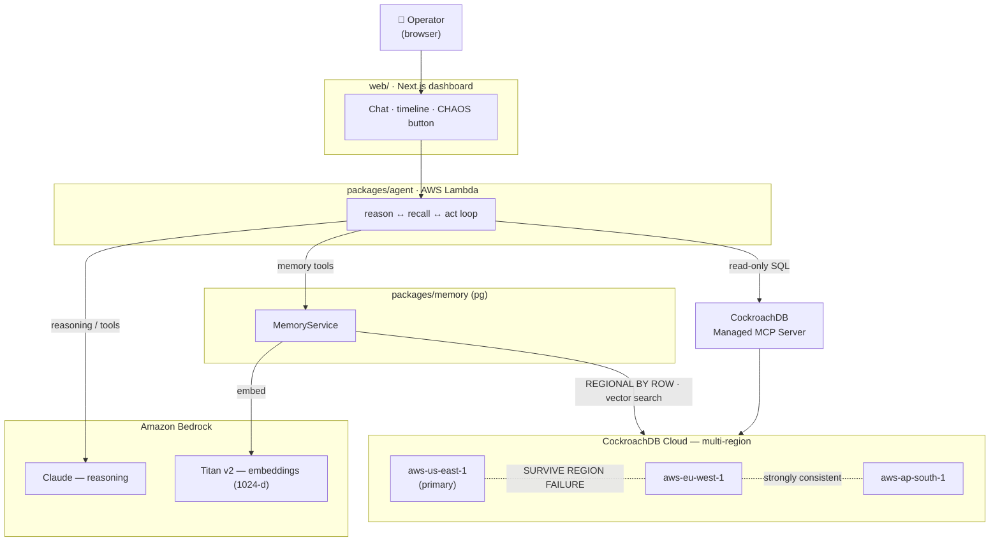

# BlackBox — Architecture

## One-liner

An SRE incident-response agent whose **agentic memory** is a multi-region
CockroachDB deployment: region-pinned by row, survivable through a full region
outage, and semantically searchable via distributed vector indexes. Reasoning
runs on Amazon Bedrock; the agent introspects its own database through the
CockroachDB Managed MCP Server.

## Diagram



## Components

### 1. Memory layer — `packages/memory`
A thin, well-typed service over the `pg` driver. Responsibilities:
- **Embeddings** via Bedrock Titan v2 (1024-dim, unit-normalized).
- **Region-aware writes**: never sets `crdb_region`; the column defaults to
  `gateway_region()`, so each memory is born in — and pinned to — the region
  that served the write.
- **Vector recall** through the distributed index using the L2 (`<->`) operator,
  with `vector_search_beam_size` tuned per query for accuracy vs latency.
- Four memory surfaces: episodic (`incidents`), procedural (`runbooks`),
  the agent's own stream (`agent_memory`), and transactional live state
  (`incident_state`).

### 2. Agent loop — `packages/agent`
A reason ↔ recall ↔ act loop on the Bedrock **Converse API** with tool use:
- Tools: `recall_similar_incidents`, `recall_runbooks`, `recall_memories`,
  `open_incident`, `update_incident_state`, `resolve_incident`, and
  `inspect_cluster` (read-only SQL via the Managed MCP Server).
- Every operator turn, agent reply, and significant action is written to
  durable memory, so the agent's context survives process restarts, new
  sessions, and region failure.
- Packaged to run locally (CLI), as an AWS Lambda handler, or behind the web UI.

### 3. Demo UI — `web` (Next.js)
Incident dashboard + agent chat + live memory feed, plus a **chaos control** that
simulates a region outage to demonstrate that the agent keeps recalling and
reasoning while a region is down.

### 4. Data plane — CockroachDB Cloud (multi-region)
Regions: `aws-us-east-1` (primary), `aws-eu-west-1`, `aws-ap-south-1`.
`SURVIVE REGION FAILURE`. All memory tables are `REGIONAL BY ROW` with
region-prefixed vector indexes.

## Request flow (a new incident)

```
operator ──▶ agent.chat(msg)
    │  1. persist user_msg to agent_memory (durable)
    │  2. Bedrock Converse: model decides to recall
    ├────▶ recall_similar_incidents ──▶ vector search (incidents)  ── CockroachDB
    ├────▶ recall_runbooks           ──▶ vector search (runbooks)   ── CockroachDB
    │  3. model reasons; optionally inspect_cluster (MCP) ── CockroachDB MCP
    ├────▶ open_incident             ──▶ INSERT (region = gateway) ── CockroachDB
    ├────▶ update_incident_state     ──▶ UPSERT transactional state ── CockroachDB
    │  4. final reply persisted as agent_msg
    ▼
 operator sees advice + trace
```

## Why this is production-shaped (judging: production readiness)

- **Security**: MCP access is read-only + statement-guarded; secrets via env;
  TLS `verify-full` to the cluster; least-privilege SQL user.
- **Observability**: every tool call + result is an event stream; every action
  is durable and queryable in `agent_memory`.
- **Scalability**: C-SPANN vector index scales per-region; the pool is bounded;
  the agent is stateless (all state in CockroachDB) so it scales horizontally on
  Lambda/ECS.
- **Resilience**: `SURVIVE REGION FAILURE` + idempotent writes mean an incident
  in one region does not take the copilot down.

## Data residency (judging: real-world impact)

Because memory is `REGIONAL BY ROW`, an EU service's incident data physically
stays in `eu-west-1`. One logical database, per-row legal domiciling — something
a single-region vector store cannot offer.
